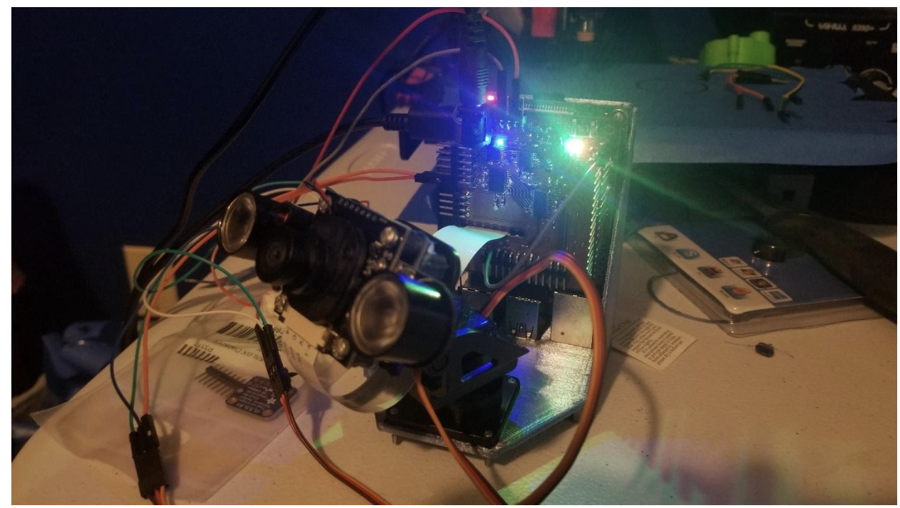

Object Tracking using a Raspberry Pi 4. 


* [Video of the the Pi Screen during Demo](https://drive.google.com/open?id=1EuTZfTK4OLIzXOUKoZkWMZ2OpnGOkIYl)
* [Video of the Servo during Demo](https://drive.google.com/file/d/1CqaZqvUET-iiFShD1uzIiYLTDpLR0OoJ/view?usp=sharing)
* [Software Implementation of Multilabel Tracking](https://drive.google.com/file/d/1P_rtwbhCzP93P-e9JhBeYXKoz-DjD-5f/view?usp=sharing) 
* [Link to Google Slides](https://docs.google.com/presentation/d/12G5F1KdZLiuIfz5qq8HF9dvrJ2lQuAD1xqTEcP2Me3o/edit?usp=sharing)
* [Presentation Video](https://drive.google.com/file/d/130o2YdwLg2BJ1cepa1x7kVlUzDuutPOH/view?usp=sharing)


## Table of Contents
* [Overview](#overview)
* [Parts List](#parts-list)
* [Installation and Setup](#installation-and-setup)
* [Tracking Algorithm](#tracking-algorithm)
* [Hardware Setup](#hardware-setup)
* [Credits](#credits)

## Overview
An object is first detcted using the Mobilenet SSD object detector and tracked using OpenCV's built in Optical Flow method. Optical flow is nothing but motion of objects between consecutive frames.
The position feedback is sent to the servomotors so that it can track the object as long as it is in the camera's line of sight. 
A RGB LED indicate whether an  object is currently being tracked.

## Parts List
Project was created with:
* Raspberry Pi 4
* Adafruit Pan-Tilt Servo Mount
* IR-Cut Pi Camera
* Custom Board
* RGB LED
	
## Installation and Setup
Installation steps on a Raspberry Pi 4:

```
$ git clone https://github.com/yshah43/object_tracker.git
$ cd object_tracker
$ pip install requirements.txt
```

To track objects of a single category, run:
```
$ python single_label_tracking.py
```

## Tracking Algorithm

Object tracking is a 2 step process where you first detect an object and then track it.
Mobilenet SSD is the backbone architecture for the detector and was implemented using OpenCV's Deep Neural Net Module. Optical flow then tracks the detected object using the Lucas-Kanade Method.


Real time performance on a Rasperry Pi without a hardware accelerator was achieved by:
* Detecting new objects every 10th frame 
* Tracking the detected object using Optical Flow
* Detecting and tracking only one category (person by default, check the .py files for other options.

All the code can be found in [single_label_tracking.py file](single_label_tracking.py).

<p align="center">

</p>

Note: [Multi-label tracking algorithm](multi_label_tracking.py) can track objects of 20 different categories but the hardware implementation for it is outside the scope of this project and is unfeasible to run on a RPI.
Here is an [example demo](https://drive.google.com/file/d/1P_rtwbhCzP93P-e9JhBeYXKoz-DjD-5f/view?usp=sharing)  which was ran on a Macbook Pro.


## Hardware Setup

The hardware for this project consists of a RPI 4, an adafruit pan-tilt servo mount, a ir-cut pi camera, and a custom board. The board is similar to some of the adafruit pi hats in that it uses a PCA9685 (a) i2c led driver to send pwm signals. There are dedicated connections on the top of the board to drive the servos (c), but they do not work for some reason and we do not have any test equipment (due to COVID19), so the servos are driven by a  TB6612 h-bridge driver (b) connected to the pwm controller. This was intended for driving dc motors and is functionally identical to the adafruit DC motor hat, but the servos are controllable through it so as long as it works right? Custom code was written to drive the servos in servo_control.py.

The Pi and the Camera were placed on a 3D Printed Mount.

For the control system, an error signal in both x and y directions are computed from the centroid found by the object tracker compared with the center of the image. This signal is modulated by a proportional gain of kx = 0.01 and ky = 0.01. The starting positions of x = 0d and y = -30d were also determined experimentally

These values were found experimentally. The response time is slightly on the slower side, and this could be improved by adding an integrator to the control system. Due to time constraints and the slightly varying update time of the object tracker, this was not pursued. 
This is a potential idea for further work.
<p> Servo Circuitry:</p>
<p align="center">

</p>
<p> Custom Peripheral Board:</p>
<p align="center">

</p>
<p> Schematic of the board</p>
<p align="center">

</p>
  

## Credits:
* Object Detector in OpenCV - [https://github.com/opencv/opencv/wiki/Deep-Learning-in-OpenCV](https://github.com/opencv/opencv/wiki/Deep-Learning-in-OpenCV)
* Optical Flow - [https://docs.opencv.org/3.4/d4/dee/tutorial_optical_flow.html](https://docs.opencv.org/3.4/d4/dee/tutorial_optical_flow.html)
* Inspiration for our custom board - [https://learn.adafruit.com/adafruit-dc-and-stepper-motor-hat-for-raspberry-pi/overview](https://learn.adafruit.com/adafruit-dc-and-stepper-motor-hat-for-raspberry-pi/overview)


