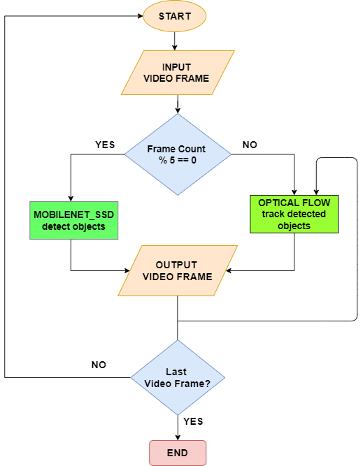

Object Tracking using a Raspberry Pi 4 and Adafruit Pan-Tilt Kit. 

## Table of Contents
* [Overview](#overview)
* [Parts List](#parts-list)
* [Setup](#setup)
* [Tracking Algorithm](#tracking-algorithm)

## Overview
An object is first detcted using the Mobilenet SSD object detector and tracked using OpenCV's built in Optical Flow algorithm.
The position feedback is sent to the servomotors so that it can track the object as long as it is in the camera's line of sight. 
A red LED indicate whether an  object is currently being tracked.

## Parts List
Project was created with:
* Raspberry Pi 4
* Camera which is compatible with RPI4
* Adafruit Pan-Tilt Kit
* Red LED
	
## Setup
Installation steps on a Raspberry Pi 4:

```
$ git clone https://github.com/yshah43/object_tracker.git
$ cd object_tracker
$ pip install requirements.txt
```

To track objects of a single category, run:
```
$ python single_label_tracking.py
```

To track objects of multiple categories, run: (NOT RECOMMENDED to run on a RPI)
```
$ python multi_label_tracking.py
```

## Tracking Algorithm

Object tracking is a 2 step process where you first detect an object and then track it.
Mobilenet SSD is the backbone architecture for the detector and was implemented using [OpenCV's Deep Neural Net Module](https://github.com/opencv/opencv/wiki/Deep-Learning-in-OpenCV). Optical flow then tracks the detected object using the [Lucas-Kanade Method](https://docs.opencv.org/3.4/d4/dee/tutorial_optical_flow.html).


Real time performance on a Rasperry Pi without a hardware accelerator was achieved by:
* Detecting new objects every 10th frame 
* Tracking the detected object using Optical Flow
* Detecting and tracking only one category (person by default, check the .py files for other options.

<p align="center">

</p>
